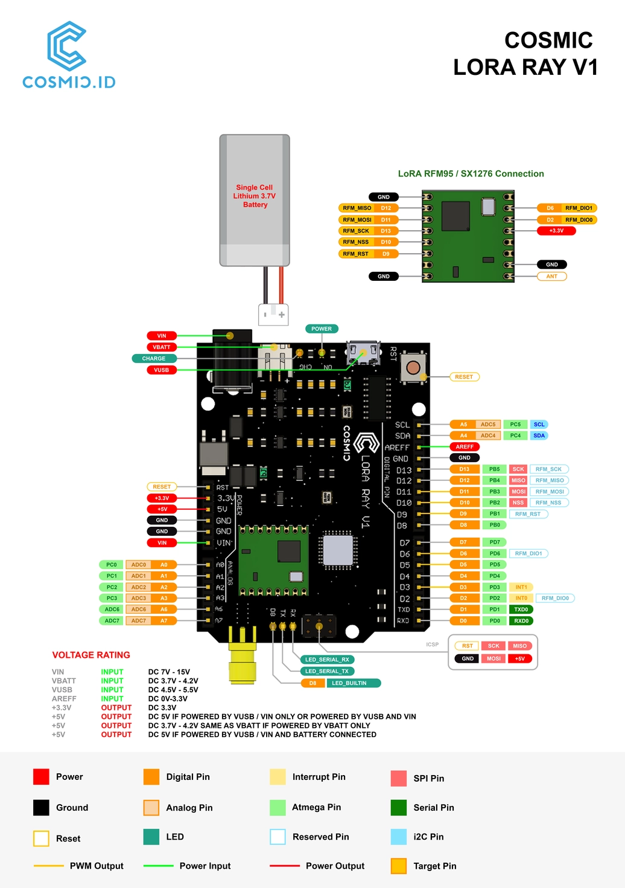

# Cosmic LoRa Ray

## Overview

Cosmic LoRa Ray is an Entry-Level Development Board that will fasten your time to market or ease your DIY project. It is armed with a low-power microcontroller ATMega 328 with Pro Mini bootloader. The low-power feature is then amplified with the selection of an 8 MHz crystal clock to make it consume less power. Furthermore, the board works with 3.3V which can be found on a rechargeable LiPo battery and solar panel. Hence, Cosmic LoRa Ray already had the on-board charging module. You just need to pick your prefered charging source either USB or DC Jack. Speaking about the connectivity as part of the a-must IoT capability, the board is equipped with the LoRa(WAN) module of [RFM95W](https://cdn.sparkfun.com/assets/learn_tutorials/8/0/4/RFM95_96_97_98W.pdf). LoRa(WAN) has a good reputation for low power consumption, making this board even more useful in a low power ecosystem. In conclusion, this is the most go-to board for your IoT applications.

> Cosmic are universe so our products name are based on universe.

[Dokumentasi dalam bahasa Indonesia](id/)

## Table of Content

* [Technical Spesification](#technical-spesification)
* [Documentation](#documentation)
  * [Pinout Diagram](#pinout-diagram)
  * [LoRaWAN Chip Interfacing](#lorawan-chip-interfacing)
  * [Examples](#examples)
* [FAQ](#FAQ)

## Technical Spesification

| Feature                 |                    Value                |  
| ----------------------- | --------------------------------------- |
| Microcontroller         |                    Atmega 328P          |
| Bootloader              |                    Pro Mini             |
| Clock Speed             |                    8 MHz                |
| DC Jack Voltage Input   |                    7-12 V               |
| USB Voltage Input       |                    4.5-5.5 V            |
| Battery Voltage Input   |                    3.7-4.2 V            |
| Dig. Input Voltage      |                    3.3 V                |
| Dig. Output Voltage     |                    3.3 V                |
| Analog Input Voltage    |                    3.3 V                |
| Analog Digital Converter Resolution     |    10 bit               |
| Max Output Current      |                    600 mA               |
| Charging Rate           |                    200 mA               |
| LoRa(WAN) Chip          |                    RFM95W               |
| LoRa(WAN) Base Freq     |                    915 MHz              |
| LoRa(WAN) Freq Range    |                    902-928 MHz          |
| Antenna Impedance       |                    50 Ohm               |
| Available I/O           |                    5 AI 5 DO 1SPI 1UART 1 I2C |
| Length                  |                    68.58mm              |
| Width                   |                    53.34mm              |
| Weight                  |                    19g                  |

## Documentation

### Pinout Diagram

> Click image for higher resolution

### LoRa(WAN) Chip Interfacing

| Cosmic LoRa Ray   | RFM95W |  
|-------------------|------- |
| D11               | MOSI   |
| D12               | MISO   |
| D13               | SCK    |
| D10               | NSS    |
| D9                | RST    |
| D2                | DIO0   |
| D6                | DIO1   |

### Examples

* [LoRa Point-to-Point](LoRa-P2P.md)
* [LoRaWAN ANTARES](LoRaWAN-ANTARES.md)

## FAQ

On-going
